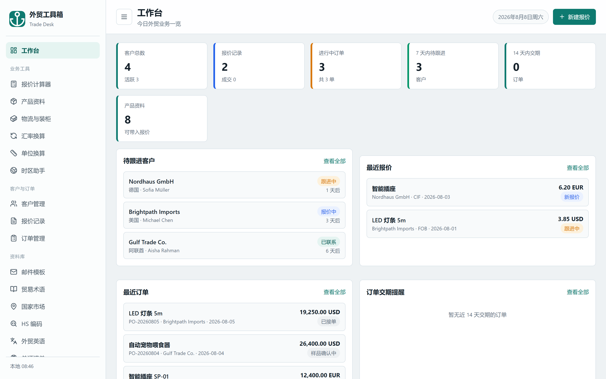
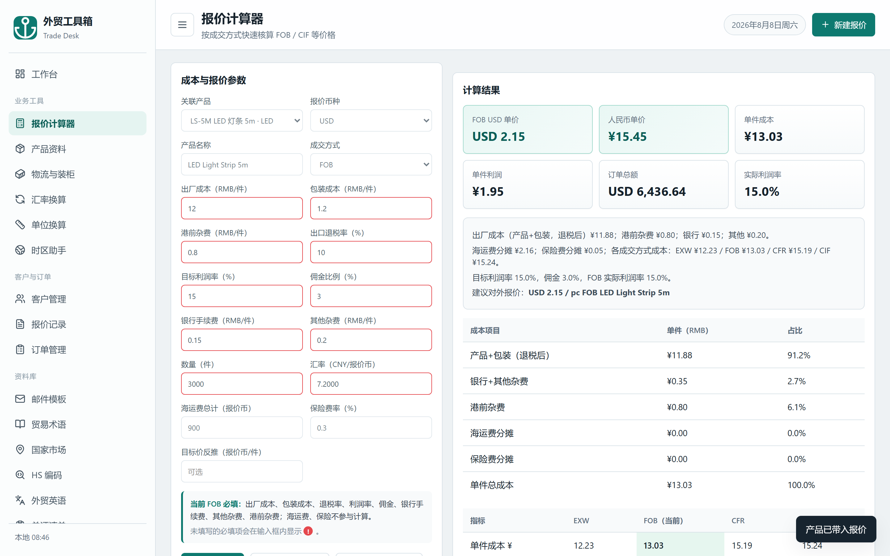
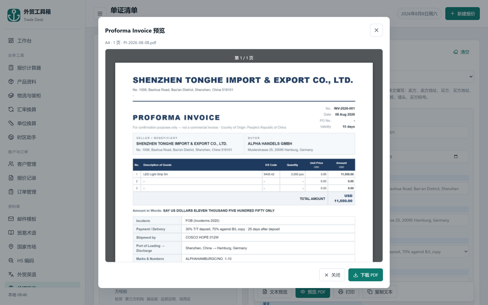
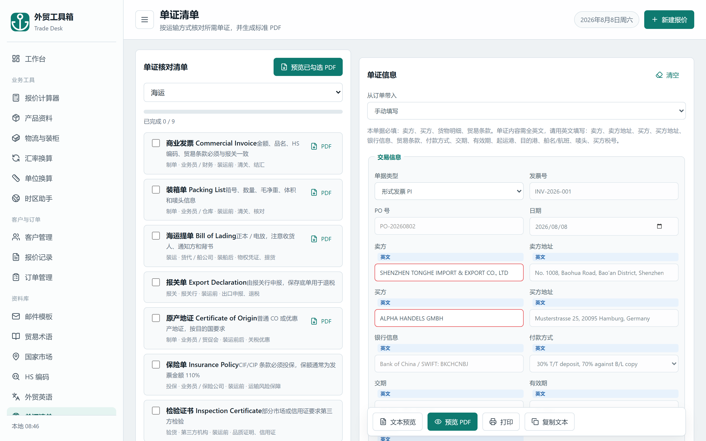
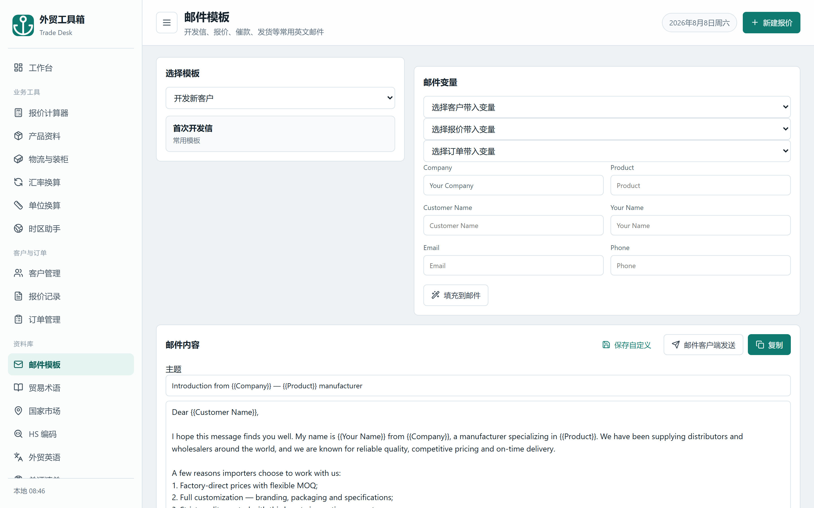
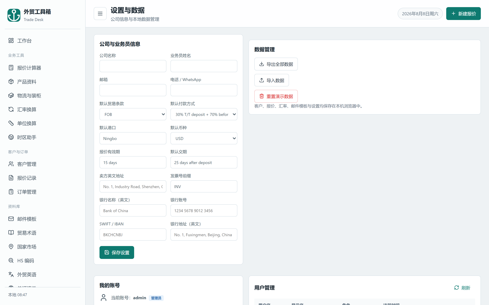
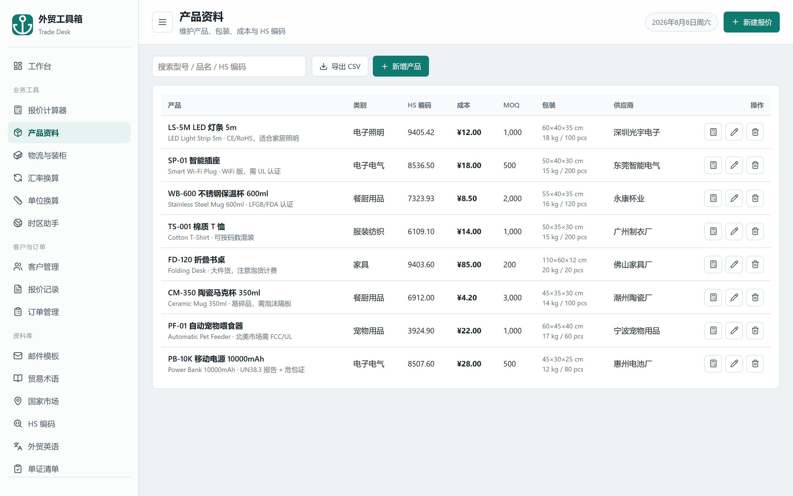
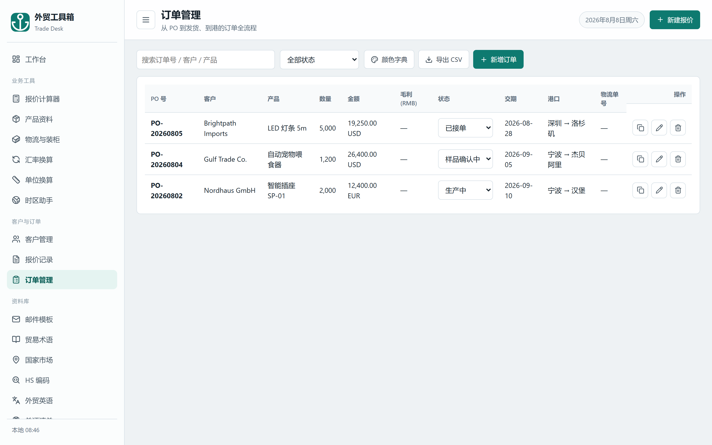
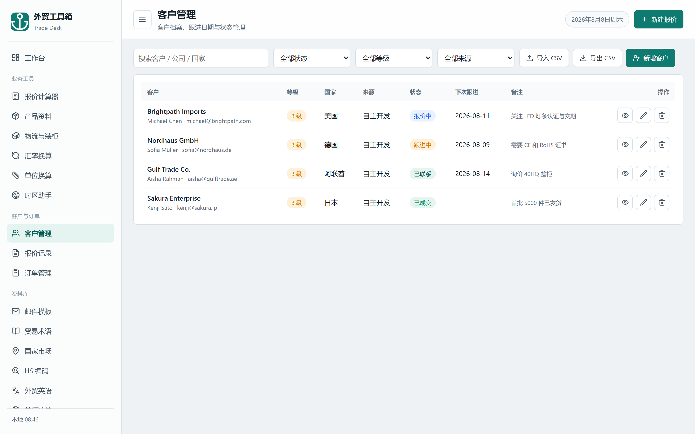

<div align="center">

# 🌍 外贸业务员工具箱 · Foreign Trade Toolbox

**开箱即用的外贸业务员工作台** —— 报价计算、客户/订单管理、专业英文单证 PDF、英文邮件模板、HS 编码查询……

纯前端 + Node 内置模块服务器，**零 npm 依赖**，局域网多人登录、数据相互独立。



</div>

---

## ✨ 功能亮点

### 💰 报价计算器

EXW / FOB / CFR / CIF 四条款成本利润对比、目标价反推、多币种报价、一键保存为报价记录并生成英文报价单 PDF。产品从产品库点选，自动带出成本、价格阶梯与英文名。



### 📄 专业英文单证 PDF

海运 / 空运 / 快递单据核对，内置 **PI / CI / PL / SA / CO / BL / AWB / BC** 8 种专业英文单证模板：公司信头、收发货人、货物表、金额大写、条款、签章一应俱全；**全英文校验**（含非英文内容会拦截提醒），货物描述自动取产品管理里的英文名。





### ✉️ 英文邮件模板

19 个专业英文邮件模板（首次开发信、询盘回复、报价跟进、催款、发货通知、售后、展会邀约……），每条带专业主题行；从客户/报价/订单一键带入变量，直接用邮件客户端发送。



### 👥 多用户与用户管理

局域网内每位业务员注册自己的账号，数据独立隔离。**首个注册账号自动成为管理员**，可在设置页管理用户：重置密码、删除用户、设置/取消管理员。



### 📦 更多模块

| | |
|---|---|
| **产品资料** — 型号/中英文名/成本/价格阶梯/MOQ/供应商，ERP 式逐行录入  | **订单管理** — PO 编号、成本毛利核算、交期倒计时  |
| **客户管理** — 客户档案、状态跟进、CSV 导入导出  | **更多** — HS 编码（内置税则 10769 条）、汇率换算、颜色字典、贸易术语、国家市场、外贸英语、单位换算、时区助手 |

---

## 🚀 快速开始（需要 Node.js ≥ 18）

```bash
# 无需安装任何依赖，直接启动
node server.js
# 或：npm start
```

浏览器打开 `http://localhost:8080`：

1. 点「注册新账号」，邀请码：**首次启动自动生成的随机码**（见服务器控制台或 `data/register-key.txt`，也可用 `REGISTER_KEY` 环境变量指定）；
2. **第一个注册的账号自动成为管理员**；
3. 登录后即可使用，数据自动保存。

> v1.1 起注册邀请码不再使用默认值 `trade123`（防止新装即被接管），密码要求 **≥ 8 位**。

> 也可以直接双击 `public/index.html` 以**本机模式**打开（不登录，数据仅存本机浏览器）。

## 🌐 局域网多人使用

1. 服务器电脑放行端口（Windows 管理员执行）：
   ```bat
   netsh advfirewall firewall add rule name="TradeToolbox" dir=in action=allow protocol=TCP localport=8080
   ```
2. 其他电脑浏览器访问 `http://服务器IP:8080`；
3. 每人注册一个账号，数据独立保存在 `data/<用户名>.json`，互不可见。

## 📦 免安装离线部署包

需要"拷过去双击即用、目标电脑无需安装 Node.js"时，可构建**免安装版**：

1. 从 [nodejs.org](https://nodejs.org) 下载 Windows 64 位 Node.js，解压取出其中的 `node.exe`（约 90MB，可直接运行）；
2. 把 `node.exe` 放到本目录，双击 `start-server.bat`（脚本自动使用内置 node.exe，并打开浏览器）。

## 🗂 目录结构

```
├── public/            # 前端（index.html / app.js / data.js / hs-full.js / vendor/）
├── server.js          # 局域网多用户服务器（仅 Node 内置模块）
├── package.json
├── start-server.bat   # Windows 一键启动（可配合内置 node.exe 免安装）
├── start-server.ps1   # PowerShell 启动脚本
└── docs/screenshots/  # 本文档截图
```

## 🛠 技术栈

- **前端**：原生 JavaScript + HTML/CSS，无框架、无构建步骤
- **服务器**：Node.js 内置模块（`http / fs / path / crypto`），**零 npm 依赖**
- **PDF**：jsPDF 生成 + pdf.js 预览；模板输出经 DOMPurify 消毒（防存储型 XSS）
- **安全**：PBKDF2-SHA256（60 万次迭代，旧哈希自动迁移）加盐哈希、HMAC 签名令牌（7 天、含密码版本号可即时撤销）、登录/注册/管理接口限流、CSP + 安全响应头、状态文件原子写 + 备份轮转、可选 HTTPS
- **授权**：ECDSA-P256 签名授权码（公司/席位/到期/机器绑定）+ 首次运行 14 天试用，详见 [docs/COMMERCIALIZATION.md](docs/COMMERCIALIZATION.md)

## 🔒 数据与安全

- 用户数据独立保存在 `data/<用户名>.json`（写入采用**临时文件+重命名**原子写，并保留最近 3 份 `.bak` 轮转备份）；账号存 `users.json`；
- 密码为 **PBKDF2-SHA256（60 万次迭代 + 16 字节盐）** 加盐哈希，不存明文，恒定时间比较；旧版低迭代哈希会在登录成功后自动重哈希迁移；
- 登录令牌 HMAC 签名、7 天有效，**携带密码版本号**：修改密码、重置密码、登出都会使旧令牌立即失效；
- 登录/注册/管理接口带**按 IP 限流**（环境变量 `RATE_LOGIN` / `RATE_REGISTER` / `RATE_ADMIN` 可调）；
- 所有响应带 **CSP**、`X-Content-Type-Options: nosniff`、`Referrer-Policy`、`X-Frame-Options` 安全头；
- 数据文件损坏时读取返回空状态，不会把坏文件当权威副本；
- `data/`、`users.json`、`.secret`、`tools/private.pem` 均在 `.gitignore` 中，**不会上传到仓库**；
- 部署后请通过环境变量设置自定义注册邀请码 `REGISTER_KEY`，尽快修改管理员密码；启用 HTTPS 请提供 `SSL_CERT` / `SSL_KEY`（或根目录 `cert.pem` / `key.pem`，自签即可）。

### 🎫 授权与试用

- 首次运行自动进入 **14 天全功能试用**（默认 3 席位，环境变量 `TRIAL_DAYS` / `TRIAL_SEATS` 可调）；
- 试用到期后需激活授权：**授权码由 ECDSA-P256 私钥离线签发**（`tools/make-license.js`），绑定机器码、可含席位与到期日；服务器只内置公钥校验，私钥不随产品分发；
- 激活入口：设置页 → 授权与试用（仅管理员）；到期后管理员仍可登录激活，普通用户被拦截；
- 签发流程与商用路线见 [docs/COMMERCIALIZATION.md](docs/COMMERCIALIZATION.md)。

## 🔄 更新

版本号在 `public/app.js` 顶部 `APP_VERSION`。增量升级只需替换 `public/` 与 `server.js`（**不要覆盖 data/、users.json**），重启服务器即可。
